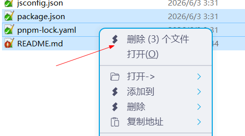
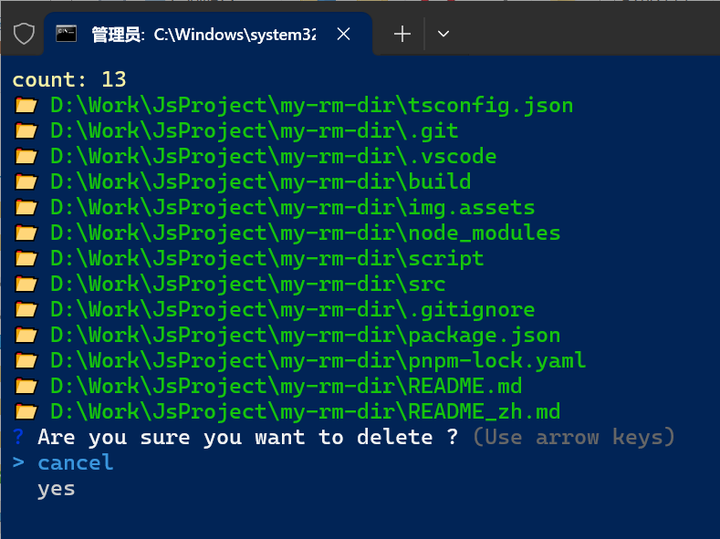
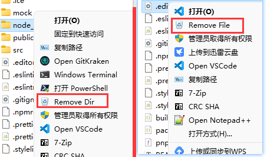
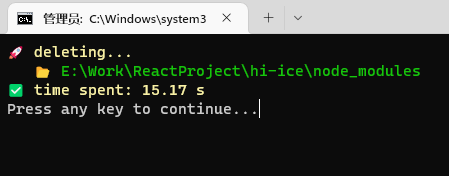

# ⚡ MyRmDir

> 快速删除「大型文件夹/文件」
>
> 比如 拥有成千上万个小文件的 `node_modules`

不需要放入回收站

不需要分析目录

不需要实时显示到 GUI

速度飞快

可添加到 windows 右键菜单注册表，操作更方便

```bash
npm install -g my-rm-dir
```

```bash
my-rm-dir .\node_modules
```

## 速度对比

以下测试数据来源于删除同一个 `node_modules`

| 名称             | 耗时(秒) |
| ---------------- | -------- |
| MyRmDir (NodeJS) | 15       |
| PowerShell       | 28.66    |
| 普通删除         | 45.55    |

## 添加到右键菜单

> 「ContextMenuManager」和「reg 注册表」二选一

**[ContextMenuManager](https://github.com/BluePointLilac/ContextMenuManager)**

可视化管理右键菜单，在「文件」「目录」中新建项，然后设置命令。

```bash
D:\Software\nvm-nodejs\nodejs\my-rm-dir "%V"
```

**注册表**

在 `cmd` 中执行 `where.exe my-rm-dir`，拿到 `本机地址`，

notepad 打开 `script/install.reg`

修改 `E:\\Software\\NodeJs\\my-rm-dir` 为 `本机地址`。(`\\` 非常重要)

保存并双击 `install.reg`，安装成功。

双击 `script/uninstall.reg` 可以卸载注册表。

## 同时删除多个文件

> Nilesoft Shell 和 AutoHotKey 二选一

**[Nilesoft Shell](https://github.com/moudey/shell)**

可以自定义右键菜单的开源软件，比原生菜单性能更好，功能更多。

nss 代码

```js
// 调用 my-rm-dir 批量删除文件
item(
    mode="multiple"
    pos="top"
    image=\ue249
    title='删除 (@sel.count) 个文件'
    vis=@(sel.count > 1)
    cmd='my-rm-dir'
    args='@str.replace(sel(true, " "),"\\","/")'
)
```

也可以用 nss 写单文件(夹)删除。

**AutoHotKey**

使用 `script/delete_select_files.ahk`

## 截图








