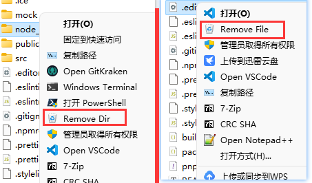
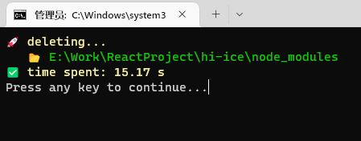
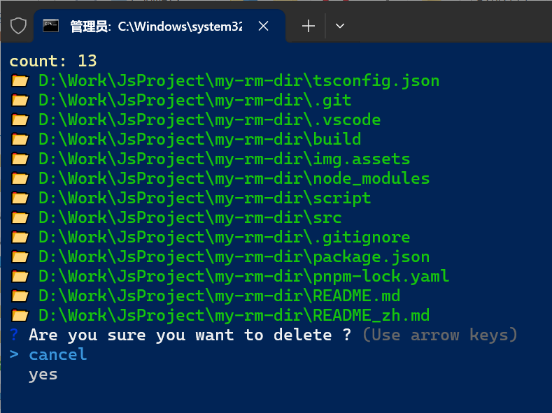

# ⚡ MyRmDir

> 快速删除大型文件夹 / 文件, 比如拥有成千上万个小文件的 `node_modules`

<div align="center">
<strong>
<samp>

[English](README.md) · [简体中文](README_zh.md)

</samp>
</strong>
</div>

不需要放入回收站

不需要分析目录

不需要实时显示到 GUI

速度飞快

可添加到 windows 右键菜单注册表, 操作更方便

# 📦 安装

```bash
npm install -g my-rm-dir
```

```bash
my-rm-dir .\node_modules
```

# 速度对比

以下测试数据来源于 删除同一个 `node_modules`

| 名称          | 耗时(秒) |
| ------------- | -------- |
| NodeJS        | 15       |
| PowerShell    | 28.66    |
| normal delete | 45.55    |

# 注册到右键菜单

> 建议使用 [ContextMenuManager](https://github.com/BluePointLilac/ContextMenuManager) 来管理右键菜单, 可视化操作更方便.
>
> 直接 新建项 , 选择图标 ,设置命令 就可以了.

## 写入注册表

- 在 `cmd` 中执行 `where.exe my-rm-dir` , 拿到 `本机地址`
- notepad 打开 `script/install.reg`
- 修改 `E:\\Software\\NodeJs\\my-rm-dir` 为 `本机地址`。 ( `\\` 非常重要)
- 修改后保存，并双击执行 `install.reg`

## 卸载注册表

双击 `script` 目录的 `uninstall.reg`

## 同时删除多个文件

使用 `script/delete_select_files.ahk`

# 截图






